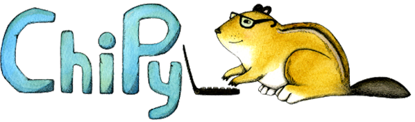
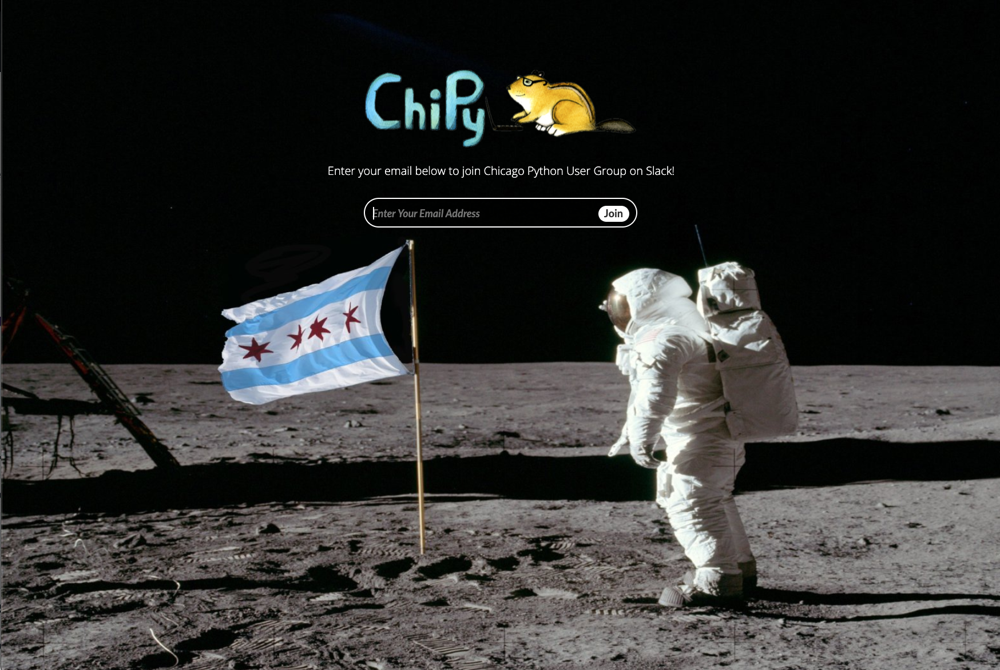

# Chicago Python Main Meeting

---

# Code of Conduct

## Our Standards
ChiPy is dedicated to providing a positive experience for everyone, regardless of age, gender identity and expression, sexual orientation, disability, physical appearance, body size, actual or perceived race, ethnicity, national origin, citizenship, color, religion (or lack thereof), veteran and/or military status marital status or parental status, pregnancy, educational background, socio-economic status, or any combination of these factors.

For the complete code of conduct see: http://www.chipy.org/pages/conduct/

---

# Other Activities

- ChiPy Giving
- Project Nights (Third Thursday)
- Special Interest Groups
    - Webdev
    - Algorithms
    - Data Science
    - Lunch

---

# Where to find us

- http://chipy.org (Join the mailing list RSVP for monthly meetings)
- @ChicagoPython tweet with us
- Github https://github.com/chicagopython/
- http://www.meetup.com/_ChiPy_/  (RSVP for monthly or SIG meetings)

---

# Slack

<table>
  <tr>
    <td>
      <h2>How To Join</h2>
      <ul>
        <li>Go to <a href="https://joinchipyslack.herokuapp.com">joinchipyslack.herokuapp.com</a></li>
        <li>Sign up link also available on www.chipy.org</li>
        <li>Join a Room, Create Your Own, Interact with our amazing Community!</li>
    </td>
    <td>
      
    </td>
  </tr>
</table>

----

# Announcements

* TBD

---

# Talks

* **Example Person** Example talk
